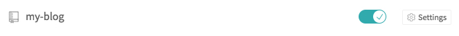
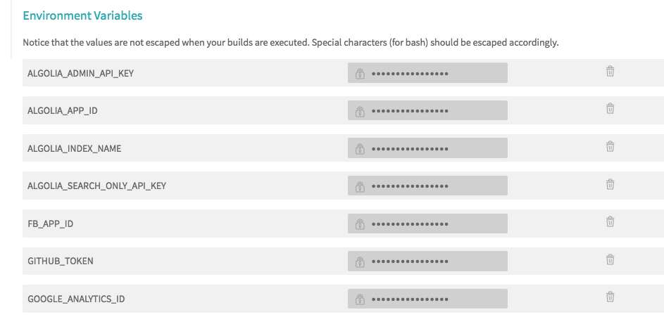

前言：之前用 Hexo 搭建的博客，稀稀散散的写一些时间，后来就懒了没有坚持下来，中断了足足一年没写了。这几天心血来潮，决定重新搭建一个，一是监督自己完成制定的计划（每周一篇，每月五篇文章），二是与各位老铁分享学习心得，三则是建立自己的知识体系，毕竟好记性不如烂笔头嘛。昨天花了一天多的时间完成了现在这个博客的模样，为什么搭个博客要花这么久，因为这里面涉及到了一些我之前没有接触过的技术，比如GraphQL、Travis CI，我都有认真的去学习了一下，还有就是把之前在 Hexo 上的几篇修改了一下添加到现在这个博客中了。接下来进入主题。

## 主题安装
为什么是主题安装呢？
因为这个主题已经帮我们打包搞定了我们需要的包括了分类、分页等等功能，直接安装它即可

```bash
npx gatsby new my-blog-starter https://github.com/gatsbyjs/gatsby-starter-blog
cd my-blog-starter/
gatsby develop
```

然后我们可以看到如下内容：
```bash

You can now view gatsby-starter-hero-blog in the browser.

  http://localhost:8000/

View GraphiQL, an in-browser IDE, to explore your site's data and schema

  http://localhost:8000/___graphql

Note that the development build is not optimized.
To create a production build, use gatsby build
```

现在就可以访问`http://localhost:8000/`来访问博客

更多内容可以查看这里[gatsby-starter-hero-blog](https://github.com/greglobinski/gatsby-starter-hero-blog)

## 修改配置
可以正常启动后，我们就可以开始修改配置了。

在`content`文件夹中进行配置，具体如下：
```bash
├── meta # 存放 meta 相关文件
│   └── config.js  # 网站信息、作者信息等设置
├── pages # 可自定义的添加页面，支持 HTML 标签
│   ├── 1--about
│   │   └── index.md
│   ├── 2--starters
│   │   ├── gatsby-starter-personal-blog.png
│   │   ├── gatsby-starter-simple-landing.png
│   │   └── index.md
│   ├── 3--front-end-dev
│   │   └── index.md
│   ├── 4--privacy
│   │   └── index.md
│   ├── 5--terms
│   │   └── index.md
│   └── success
│       └── index.md
├── parts  # 区块，相当于组件
│   ├── author.md
│   └── footnote.md
└── posts # 存放文章
    ├── 2017-10-01--two-things-are-infinite  # 文件夹名必须是 日期--文章名 
    │   ├── index.md   # 文章
    │   └── photo-1490474418585-ba9bad8fd0ea.jpg # cover
    ├── 2017-10-03--be-who-you-are
    │   ├── index.md
    │   └── photo-1489824904134-891ab64532f1.jpg
    ├── 2017-10-05--you-only-live-once
    │   ├── index.md
    │   └── photo-1456518563096-0ff5ee08204e.jpg
    ├── 2017-10-07--people-will-forget
    │   ├── index.md
    │   └── photo-1489900464632-5f5907edda24.jpg
    ├── 2017-10-09--i-am-so-clever
    │   ├── index.md
    │   └── photo-1507124484497-b7f446e65519.jpg
    ├── 2017-10-11--imperfection-is-beauty
    │   ├── index.md
    │   └── photo-1469461084727-4bfb496cf55a.jpg
    ├── 2017-10-13--there-are-only-two
    │   ├── index.md
    │   └── photo-1451324119451-db0ac857463c.jpg
    ├── 2017-10-15--good-friends
    │   ├── index.md
    │   └── photo-1500531279542-fc8490c8ea4d.jpg
    ├── 2017-10-17--i-have-not-failed
    │   ├── index.md
    │   └── photo-1463852247062-1bbca38f7805.jpg
    ├── 2017-10-19--i-may-not-have-gone
    │   ├── index.md
    │   └── photo-1507915600431-5292809c5ab7.jpg
    ├── 2017-10-21--like-nonsense
    │   ├── 33893097-e5a70c34-df5a-11e7-8f5e-40e057626770.png
    │   ├── index.md
    │   └── photo-1465070845512-2b2dbdc6df66.jpg
    └── draft-post
        ├── index.md
        └── photo-1490474418585-ba9bad8fd0ea.jpg
```

每篇文章 markdown 必须在前面加上如下文章信息，不然会运行报错：
```bash
---
title: Good friends, good books, and a sleepy conscience
cover: photo-1500531279542-fc8490c8ea4d.jpg
author: greg lobinski
---
```

## 发布至 GitHub 仓库
首先安装 gh-pages
```bash
yarn add -D gh-pages
```

然后在`package.json`中添加如下命令：
```json
...
"deploy": "npm run build && gh-pages -r git@github.com:zenghongtu/zenghongtu.github.io.git -b master -d public",
...
```
运行该命令会打包并发布至目标仓库，其中`-r`后面添加的是上传的目标仓库，`-b`后面是目标分支，`-d`后面是需要发布的文件夹。

这个时候，我们可以打开相对应的地址，我这里是`zenghongtu.github.io`，查看部署后的博客。

## 添加 Travis CI 自动构建
接下来才是我们的重头戏，通过 Travis CI 实现自动构建。

首先到[travis-ci](https://travis-ci.org)注册账号，并绑定我们的 GitHub 账号，找到我们项目的仓库，我这里是`my-blog`，打开后面的小开关。如下：


然后在*设置*里面把需要的环境变量填入：



其中`GITHUB_TOKEN`为 GitHub 的 access_token，需要到 setting 中生成一个，其他的是可选的 key，如果需要开启相关的功能则需要设置。

然后在项目新建`.travis.yml`文件，添加配置内容：
```bash
language: node_js
node_js: --lts
cache: npm
sudo: required
branches:
  only:
    - master

before_install:
  - npm install -g gatsby

install:
  - npm install

before_script:
  - git config user.name "zenghongtu"
  - git config user.email "zenghongtu@gmail.com"
  - sed -i'' "s~git@github.com:zenghongtu/zenghongtu.github.io.git~https://${GITHUB_TOKEN}@github.com/zenghongtu/zenghongtu.github.io.git~" package.json

script:
  - npm run deploy

```

每次 push 到仓库，就会调用 Travis CI 自动构建，这样就大功告成了。
