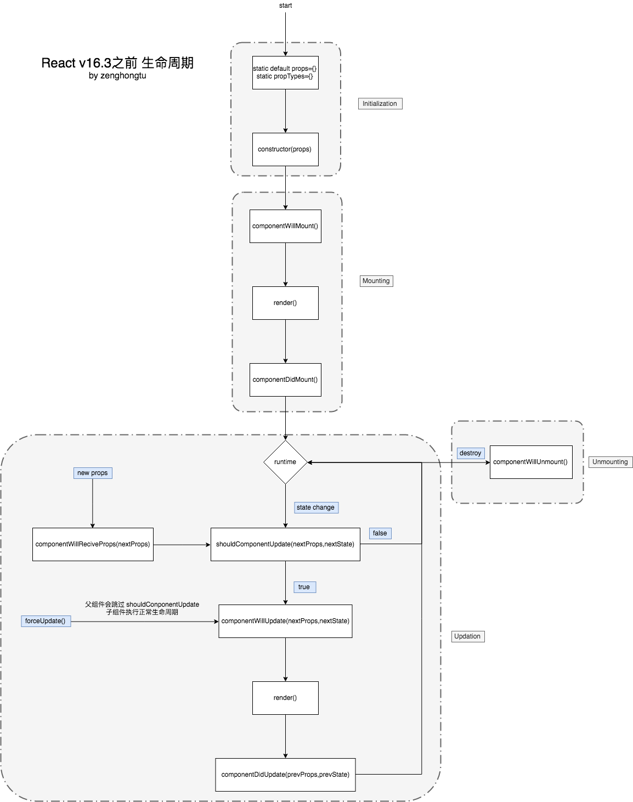
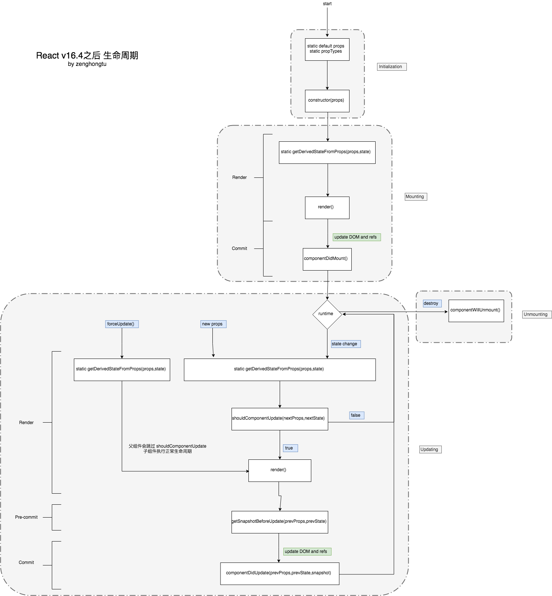

前言：React 的版本从 v15 到 v16.3 ，再到v16.4，现在最新的版本是 v16.8了。其中最大的变化可能是`React Hooks`的加入，而最令人困惑的却是它的生命周期，新旧生命周期函数混杂在一起，难免会让许多新来者有很多困惑。所以这一篇我们来分析一下 React 生命周期的演变及原因，进一步理解其使用。

## 组件生命周期的四个阶段
1. Initialization  （初始化阶段：组件实例的创建）
2. Mounting   （加载阶段：组件插入 dom中）
3. Updating  （更新阶段：属性或状态每改变一次都将会触发一次，组件重新渲染。）
4. Unmounting  （卸载阶段：组件卸载和销毁）

## 老版生命周期（16.3之前的生命周期）




### Initialization  （初始化阶段：涉及4个钩子函数）
这些方法会在组件初始化的时候被调用，只跟实例的创建有关。
如果用`createReactClass`进行创建，则还有`getInitialState`这些生命周期函数，但很少使用，我们这里不提及。

#### static defaultProps{} （getDefaultProps()）
定义默认`props`，会和父组件传下来的`props`进行合并，且以父组件中的`props`优先级更高，相当于`{...defaultProps, props}`。

#### static propTypes{} （getInitialState()）
定义`props`的数据类型，可以帮助我们确定其有效性，减少许多开发中不必要的错误。

#### constructor()
在加载阶段前调用一次，进行 state 的初始化。
```js
constructor(props){
    super(props)
}
```
`super(props)`用来调用父类的构建方法。

### Mounting   （加载阶段：涉及3个钩子函数）
#### componentWillMount()
新版中为`UNSAFE_componentWillMount()`。

只在组件加载时调用，整个生命周期只调用一次，以后组件更新也不会调用，此时可以修改 state。

#### render()
`react` 中最重要的生命周期函数，创建虚拟 dom，并进行 `diff` 算法，更新 dom 树也在此进行。所以不应该在此改变组件的状态或者与浏览器进行交互。

**注意：**这个函数不能缺少，如果不创建虚拟 dom，可以`return null`。

#### componentDidMount()
组件加载完成后立即调用，整个生命周期只调用一次，可以获取到更新后的 DOM，在此处可以进行网络请求等。

### Updating  （更新阶段：涉及5个钩子函数）
#### componentWillReceiveProps()
新版中为`UNSAFE_componentWillReceiveProps()`。

在组件加载后，如果有新的`props`传递过来，会先调用这个函数，可以在这里调用`setState()`修改`state`。

```
componentWillReceiveProps(nextProps)
```

#### shouldComponentUpdate()
`react`中一个重要的性能优化点，组件接收到新的`props`或者`state`，返回`true`表示需要更新 dom，返回`false`阻止更新。

```
shouldComponentUpdate(nextProps, nextState)
```

#### componentWillUpdate()
新版中为`UNSAFE_componentWillUpdate()`。

组件加载时不调用，只有在组件需要更新（即`shouldComponentUpdate`返回`true`）时调用。

```
componentWillUpdate(nextProps, nextState)
```

**注意**：不能在这个方法中调用`setState()`修改`state`。

#### render()
同上。

#### componentDidUpdate()
在组件更新完成后立即被调用，可以进行网络请求等。
```
componentDidUpdate(prevProps, prevState)
```

### Unmounting  （卸载阶段：涉及1个钩子函数）
#### componentWillUnmount()
在组件被卸载和销毁之前调用，可以在这里处理任何必要的清理工作，比如解除定时器，取消已经发起的网络请求，清理在`componentDidMount`函数中创建的 DOM 元素。
```
componentWillUnmount()
```

### Error Handling（错误处理：涉及1个钩子函数）
#### componentDidCatch()
错误边界捕获，在v16.0刚推出的时候新增加的一个生命周期函数，用于捕获在**子组件树**中任意地方发生的 JavaScript 错误，一个错误边界不能捕获它自己内部的错误。
```
componentDidCatch(error, info)
```

### 组件的基本写法
```
import React, {Component} from 'React'

export default class OldReactComponent extends Componet{
    static defaultProps={}
    static propTypes={}
    constructor(props){
        super(props)
    }
    state={}
    componentWillMount(){}
    render(){
        return null
    }
    componentDidMount(){}
    componentWillReceivePorps(nextProps){}
    componentShouldUpdate(nextProps,nextState){
        return true
    }
    componentWillUpdate(nextProps,nextState){}
    componentDidUpdate(){}
    componentWillUnmount(){}
}
```
## 新版生命周期（16.4之后的生命周期）


（带`UNSAFE_`的函数在以后将会被丢弃，官方也不建议使用，这里不再列出。）

新版本中，新增了三个生命周期函数：

- static getDerivedStateFromProps() 
- getSnapshotBeforeUpdate
- static getDerivedStateFromError()

同时deprecate了一组生命周期API，包括：

- componentWillReceiveProps
- componentWillMount
- componentWillUpdate

可以看出除了`shouldComponentUpdate`之外，`render` 之前的所有生命周期都被消灭了。原因是这些生命周期太多时候没有被正确使用，而且在`Fiber`之后，**如果要开启`async rendering`，在`render`函数之前的所有函数，都有可能被执行多次。**

### Initialization  （初始化阶段：涉及4个钩子函数）
同上。

### Mounting   （加载阶段：涉及3个钩子函数）
#### static getDerivedStateFromProps()
因为是静态方法，所以无法访问到组件实例。每次组件调用`render`前都会被调用，获取新的`props`和`state`（v16.3只会为`props`的而调用，v16.4修正为`props`和`state`)之后，返回一个对象作为新的`state`，如果返回`null`则表示不需要更新；配合componentDidUpdate，可以覆盖componentWillReceiveProps的所有用法。并且它应该是个纯函数，没有副作用(side effect)。
```
static getDerivedStateFromProps(props,state)
```

#### render()
同上。

#### componentDidMount()
同上。

### Updating  （更新阶段：涉及5个钩子函数）
#### static getDerivedStateFromProps()
同上。

#### shouldComponentUpdate()
同上。

#### render()
同上。

#### getSnapshotBeforeUpdate()
触发时间: update发生的时候，在render之后，在组件dom渲染之前；返回一个值，作为componentDidUpdate的第三个参数；配合componentDidUpdate, 可以覆盖componentWillUpdate的所有用法，常用于 scroll 位置的定位。

```
getSnapshotBeforeUpdate(prevProps, prevState)
```


#### componentDidUpdate()
同上。


### Unmounting  （卸载阶段：涉及1个钩子函数）
#### componentWillUnmount()
同上。

### Error Handling（错误处理：涉及2个钩子函数）
#### componentDidCatch()
同上。

#### static getDerivedStateFromError()
 用于在“render”阶段（非`render`函数）的错误捕获，应该是个纯函数，没有副作用(side effect)。

```
static getDerivedStateFromError(error)
```

### 组件的基本写法

```
import React, {Component} from 'React'

export default class OldReactComponent extends Componet{
    static defaultProps={}
    static propTypes={}
    constructor(props){
        super(props)
    }
    state={}
    static getDerivedStateFromProps(props,state){}
    render(){
        return null
    }
    componentDidMount(){}
    componentShouldUpdate(nextProps,nextState){
        return true
    }
    getSnapshotBeforeUpdate(prevProps, prevState){}
    componentDidUpdate(){}
    componentWillUnmount(){}
}

```

## 总结
1. React新的生命周期新增`static getDerivedStateFromProps`、`getSnapshotBeforeUpdate`并弃用`componentWillMount`，`componentWillReceiveProps`，`componetWillUpdate`（这三个函数将在 React 17中删除）。

2. 新增`static getDerivedStateFromError`捕获“render”阶段的错误。


## 参考
> [帮你理清React的生命周期](https://segmentfault.com/a/1190000017175195)

> [React-新的生命周期（React16版本）](https://segmentfault.com/a/1190000016617400)

> [React v16.3之后的组件生命周期函数](https://zhuanlan.zhihu.com/p/38030418)