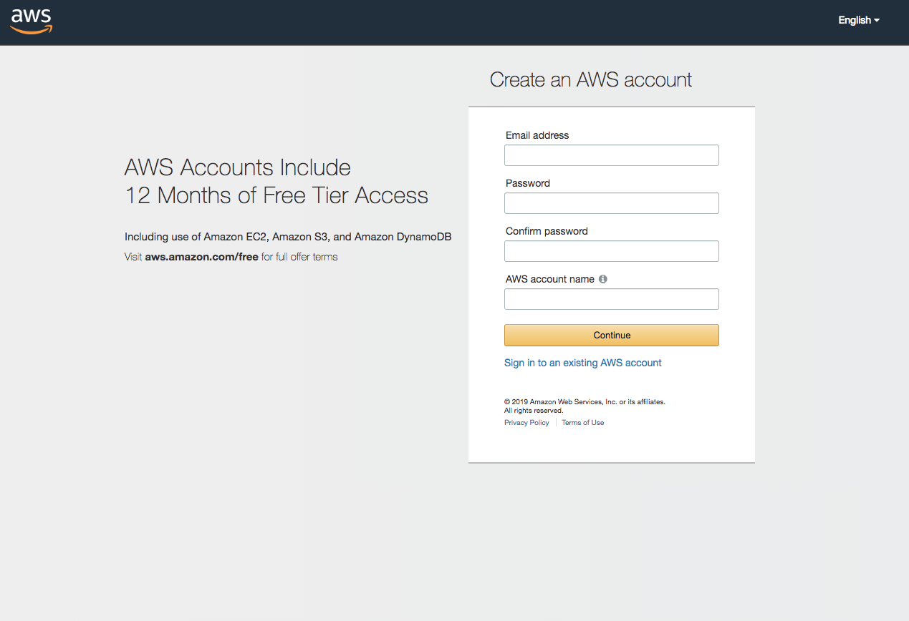
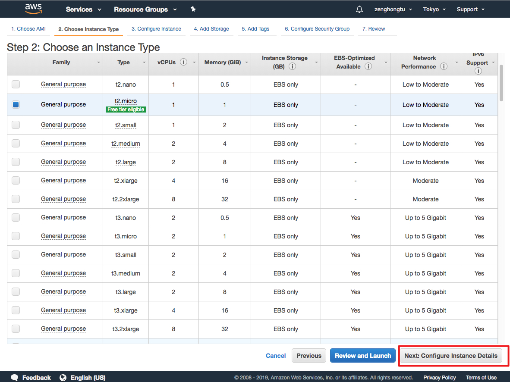
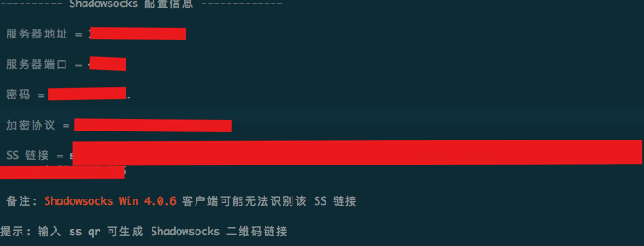

#  国内信用卡撸 AWS 免费一年服务器，快速搭建 ss
前言：今早收到阿里云的`违规信息整改通知`，吓得我一惊，之前看 v 站老铁收到这邮件，这事现在轮到我身上了，赶紧上服务器把酸酸乳关了。研究了一番，发现 aws 现在可以直接用国内的信用卡了，这还不赶紧撸一波。因为只有一年免费使用，超出了直接扣信用卡，现在记录一下，提醒自己一年后要关闭，切记切记。

## 注册 aws 账号

官网地址：[https://signin.aws.amazon.com](https://signin.aws.amazon.com)，点击注册。

在注册页，填入必要的信息。

点击确定后，接下来填入一些其他信息

然后点击 创建账号并继续。

接下来的步骤我忘了截图，借用一下其他大佬的图片：

这里填写你的信用卡信息，然后点安全提交。注意必须是可以正常使用的信用卡，会给你发 $1 的扣费请求。

然后就是这一步，验证手机号。我今天注册的时候，可以选择接收sms了！

输入验证码，验证成功后

选择免费就可以了。

## 创建实例

进入[https://signin.aws.amazon.com](https://signin.aws.amazon.com)，输入刚才注册的账号密码。

接下来可以到[www.cloudping.inf](https://www.cloudping.info/)，测试一下 aws 哪个区域的服务器到我这里延迟最低。

去除国内服务器之后，我这里是 Tokyo 最快。

到地区中选择 Tokyo。

然后选择 创建 EC2 服务器

我个人最喜欢的 debian，可惜这里没有，就选择 ubuntu 了。

接下来的步骤，跟着图片中的设置就可以了。

到这里，我们就完成了实例的创建，接下来是 ss 的安装。

## ss 安装
我这里偷个懒，用的大佬@[233boy](https://233blog.com)做好的一键安装包，非常便捷。

在命令行中输入 `bash <(curl -s -L https://git.io/ss.sh)`，设置一下密码，然后等一会就装好了。

然后到[官网](https://shadowsocks.org/en/download/clients.html)下载你所需要的客户端，在其中添加配置信息信息中的 ss 链接就可以了。

## 最后

最最重要一点，aws 试用期只有1年，在到期之前记得要先销毁实例，最好把账号也关闭了。

关闭账号链接：[https://console.aws.amazon.com/billing/home?#/account](https://console.aws.amazon.com/billing/home?#/account)，拉到最后，就可以看到关闭选项。
