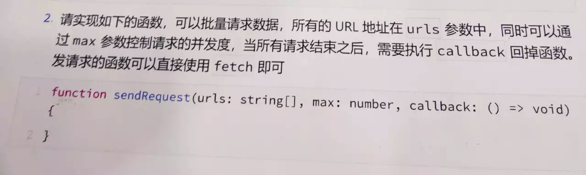
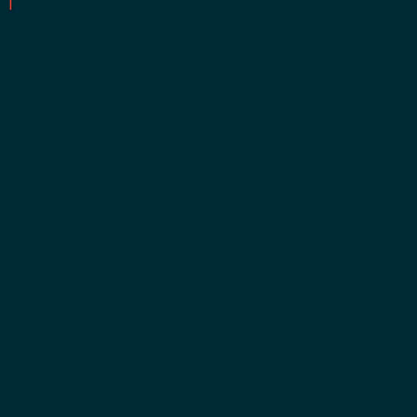
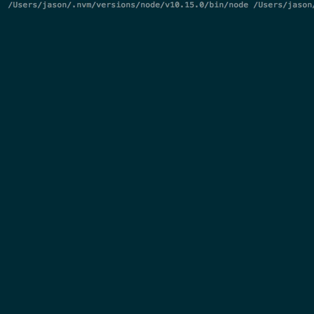

> 早上吃早餐边逛掘金的时候看到一个面试题，看下面的各位大佬各显神通，我也手痒，拿起我的机械键盘一顿乱敲，发现只需要30行代码就可以实现，似不似很腻害👻👻，快来跟我往下翻😛


**2019-03-14晚补充：吃了晚饭看到大佬 @serialcoder 的回复，直接石化了，又仔细读了一遍题目，发现确实审错题目了，太大意了😢我之前的实现是多个请求同时进行，但不是并发，而是多个同时进行的串行。于是乎我开始了又一顿乱敲，差不多半小时搞定。这会应该没错了，而且只用了23行，赶紧把标题也给改了😝**


## 原题



> 题目来源：[记一道控制并发数的前端面试题【手动维护 HTTP 请求排队】](https://juejin.im/post/5c88aaa05188257e1f2925a8?utm_source=gold_browser_extension)

## 思路

### 读题

~~快速过一遍题目，可以获得这几个主要信息：~~（罪魁祸首，读题要仔仔细细的读，不能贪快😢）

1. 批量请求
2. 可控制并发度
3. 全部请求结束，执行 `callback`

### 解题

1. 批量请求

要实现批量请求，而且并不需要按顺序发起请求（如果需要按顺序可以存入队列中，按优先级则可以存入优先队列中），所以这里我们存入数组中即可，然后进行遍历，取出数字中的每一项丢去`fetch`中进行调用。

2. 可控制并发度

~~控制并发数，一个简单的办法就是对数组进行切片，分成一段一段，完成一段后再调用另一段。这里我们可以使用递归或者循环来实现，我觉得递归比较直观，所以这里使用递归来实现。~~
本题的难点就在这里，之前做错了就是这一步。在控制并发数的同时，每结束一个请求并发起一个新的请求。依旧使用递归的方式，但这次添加一个请求队列，然后我们只要维护这个队列，每次发起一个请求就添加进去，结束一个就丢出来，继而实现了控制并发。

3. 全部请求结束，执行 `callback`

因为是异步请求，我们无法寄希望于安装正常的顺序在函数调用后执行，但是每次`fetch`有返回结果会调用`then`或者`catch`，我们可以在这个时候判断请求数组是否为空就可以知道是否全部被调用完


### 写题


### 之前❌的代码
这一步就没什么可以说的了，撸起袖子就是敲~

```JavaScript
function handleFetchQueue(urls, max, callback) {
  const requestArr = [];
  urls.forEach((item, idx) => {
    const i = Math.floor(idx / max);
    if (requestArr[i]) {
      requestArr[i].push(item)
    } else {
      requestArr[i] = [item]
    }
  });

  const handleSubRequests = (subReqs) => {
    const results = [];
    subReqs.forEach(req => {
      fetch(req).then(res => {
        if (results.push(res) === max) {
          if (requestArr.length < 1) {
            'function' === typeof callback && callback(results)
          } else {
            handleSubRequests(requestArr.shift(), requestArr, max)
          }
        }
      }).catch(e => {
        results.push(e)
      })
    })
  };
  handleSubRequests(requestArr.shift())
}
```

这里需要稍微提一下的两个小技巧：

- 通过` Math.floor(idx / max)`我们可以轻松的将每一项推入正确的子数组中
- 善用数组的返回值：`results.push(res) `返回数组长度，直接用就好啦


附上完整测试代码：

```JavaScript
function handleFetchQueue(urls, max, callback) {
  const requestArr = [];
  urls.forEach((item, idx) => {
    const i = Math.floor(idx / max);
    if (requestArr[i]) {
      requestArr[i].push(item)
    } else {
      requestArr[i] = [item]
    }
  });

  const handleSubRequests = (subReqs) => {
    const results = [];
    subReqs.forEach(req => {
      fetch(req).then(res => {
        if (results.push(res) === max) {
          if (requestArr.length < 1) {
            'function' === typeof callback && callback(results)
          } else {
            handleSubRequests(requestArr.shift(), requestArr, max)
          }
        }
      }).catch(e => {
        results.push(e)
      })
    })
  };
  handleSubRequests(requestArr.shift())
}


const urls = Array.from({length: 10}, (v, k) => k);

const fetch = function (idx) {
  return new Promise(resolve => {
    console.log(`start request ${idx}`);
    // 模拟请求时间
    const timeout = parseInt(Math.random() * 1e4);
    setTimeout(() => {
      console.log(`end request ${idx}`);
      resolve(idx)
    }, timeout)
  })
};

const max = 4;

const callback = () => {
  console.log('run callback');
};

handleFetchQueue(urls, max, callback);
```

因为我在 Node 中运行，(lan)懒(ai)得(fa)丢(zuo)浏览器中去跑了，所以随手模拟了一个`fetch`函数。

### ✅的代码

```JavaScript
function handleFetchQueue(urls, max, callback) {
  const urlCount = urls.length;
  const requestsQueue = [];
  const results = [];
  let i = 0;
  const handleRequest = (url) => {
    const req = fetch(url).then(res => {
      const len = results.push(res);
      if (len < urlCount && i + 1 < urlCount) {
        requestsQueue.shift();
        handleRequest(urls[++i])
      } else if (len === urlCount) {
        'function' === typeof callback && callback(results)
      }
    }).catch(e => {
      results.push(e)
    });
    if (requestsQueue.push(req) < max) {
      handleRequest(urls[++i])
    }
  };
  handleRequest(urls[i])
}
```

### ❌代码和✅代码测试比对

先来看错误的，可以发现是串行执行的：




再看正确的代码，这才是并发：




贴上完整代码：

```JavaScript
function handleFetchQueue(urls, max, callback) {
  const urlCount = urls.length;
  const requestsQueue = [];
  const results = [];
  let i = 0;
  const handleRequest = (url) => {
    const req = fetch(url).then(res => {
      console.log('当前并发： '+requestsQueue);
      const len = results.push(res);
      if (len < urlCount && i + 1 < urlCount) {
        requestsQueue.shift();
        handleRequest(urls[++i])
      } else if (len === urlCount) {
        'function' === typeof callback && callback(results)
      }
    }).catch(e => {
      results.push(e)
    });
    if (requestsQueue.push(req) < max) {
      handleRequest(urls[++i])
    }
  };
  handleRequest(urls[i])
}


const urls = Array.from({length: 10}, (v, k) => k);

const fetch = function (idx) {
  return new Promise(resolve => {
    console.log(`start request ${idx}`);
    const timeout = parseInt(Math.random() * 1e4);
    setTimeout(() => {
      console.log(`end request ${idx}`);
      resolve(idx)
    }, timeout)
  })
};

const max = 4;

const callback = () => {
  console.log('run callback');
};


handleFetchQueue(urls, max, callback);
```

## 总结

通过**读题**、**解题**和**写题**三个步骤（自创的😛），可以让我们的思路非常清晰，非常 easy 的解决面试题。

题目敲了20分钟代码解决，但是文章写了一小时，太不容易了，觉得不错请给我鼓个掌~~

在做之前更加重要的是不能掉以轻心，免得尴尬~~


