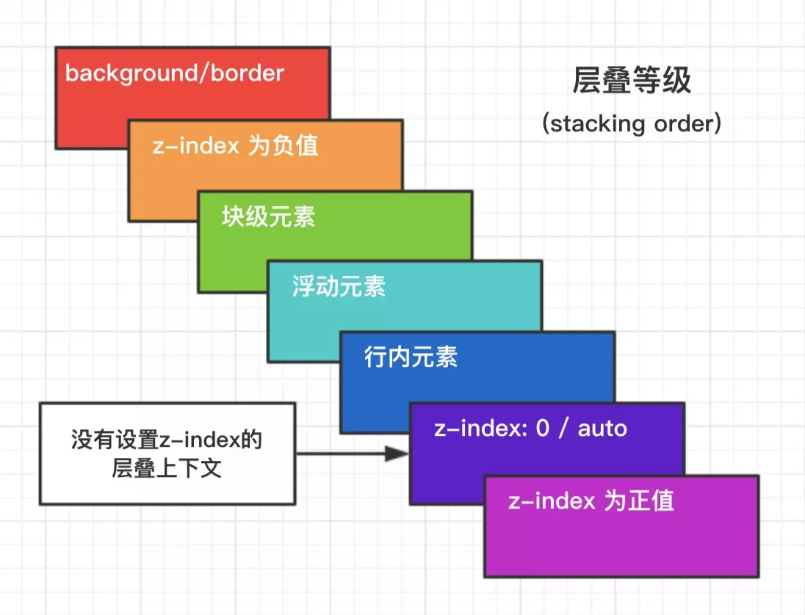

> 最近复习 CSS 知识遇到一些之前模糊或者忘记了的知识点，这里把它们都记下来，有时间就看看，加强记忆。

## Box 和 FC（即 formatting context）

### Box

一个页面是由很多个 Box 组成的，元素的类型和 display 属性决定了这个 Box 的类型。不同类型的 Box，会参与不同的 Formatting Context。

Block level的box会参与形成BFC，比如display值为block，list-item，table的元素。

Inline level的box会参与形成IFC，比如display值为inline，inline-table，inline-block的元素。

### FC（Formatting Context）

它是W3C CSS2.1规范中的一个概念，定义的是页面中的一块渲染区域，并且有一套渲染规则，它决定了其子元素将如何定位，以及和其他元素的关系和相互作用。

常见的Formatting Context 有：Block Formatting Context（BFC | 块级格式化上下文） 和 Inline Formatting Context（IFC |行内格式化上下文）。


## BFC

### 规则

1. 内部的Box会在垂直方向，一个接一个地放置。
2. Box垂直方向的距离由margin决定。属于同一个BFC的两个相邻Box的margin会发生重叠
3. 每个元素的左外边缘（margin-left)， 与包含块的左边（contain box left）相接触(对于从左往右的格式化，否则相反)。即使存在浮动也是如此。除非这个元素自己形成了一个新的BFC。
4. BFC的区域不会与float box重叠。
5. BFC就是页面上的一个隔离的独立容器，容器里面的子元素不会影响到外面的元素。反之也如此。
6. 计算BFC的高度时，浮动元素也参与计算

### 形成规则

1. 根元素或其它包含它的元素
2. 浮动 (元素的 float 不是 none)
3. 绝对定位的元素 (元素具有 position 为 absolute 或 fixed)
4. 非块级元素具有 display: inline-block，table-cell, table-caption, flex, inline-flex
5. 块级元素具有overflow ，且值不是 visible

为什么display: inline-block;的元素是inline level 的元素，参与形成IFC，却能创建BFC？

> inline-block的元素的内部是一个BFC，但是它本身可以和其它inline元素一起形成IFC。

### 用处

1. 清除浮动，解决父级元素塌陷问题
2. 布局：对于两栏或三栏浮动自适应布局，包含块边接触问题。
3. 防止垂直margin出现重合
4. 可以阻止元素被浮动元素覆盖


## IFC布局规则

在行内格式化上下文中，框(boxes)一个接一个地水平排列，起点是包含块的顶部。水平方向上的 margin，border 和 padding在框之间得到保留。框在垂直方向上可以以不同的方式对齐：它们的顶部或底部对齐，或根据其中文字的基线对齐。包含那些框的长方形区域，会形成一行，叫做行框。

## 清除浮动

一般有两种思路：

- 添加新的元素 、应用 clear：both；
    > 给父元素再加一个块级子容器，当然这个也就是父元素的最后一个块级子容器了。同时给这个块级子容器设置clear属性来清除其浮动，这样这个子容器就能排列在浮动元素的后面，同时也把父元素的高度撑起来了。那么父元素的同级元素也能正常排列了。所以这个子容器不能有高度和内容，不然会影响父元素的布局。

- 父元素添加伪元素、应用display:block、content:''、clear:both
    > 伪元素清除浮动的核心原理其实是在给父元素增加块级容器，同时对块级容器设置clear属性，使其能够清除自身的浮动，从而正常按照块级容器排列方式那样排列在浮动元素的下面。同时，父元素的同级元素也会正常排列在伪元素形成的块级元素后面，而不受浮动影响。

- 使父容器形成BFC
    > 计算 BFC 的高度时，浮动子元素也参与计算


## 层叠上下文

### z-index

- 定位元素默认z-index:auto可以看成是z-index:0（层级理解上）；
    > 定位元素会覆盖普通元素。因为：z-index只对定位元素起作用，z-index:auto的层叠顺序大于图片这个内联元素。
    > 如果层叠上下文元素不依赖z-index数值，则其层叠顺序是z-index:auto可看成z:index:0级别；
    > 如果层叠上下文元素依赖z-index数值，则其层叠顺序由z-index值决定。
- z-index不为auto的定位元素会创建层叠上下文；
    > z-index负值的层叠顺序在层叠上下文元素背景色之上
- z-index层叠顺序的比较止步于父级层叠上下文；

```HTML
<div style="position:relative; z-index:auto;">
        <-- 横妹子 -->
</div>
<div style="position:relative; z-index:auto;">
        <-- 竖妹子 -->
</div>
```

`z-index`为`auto`不会创建层叠上下文，即所在的`<div>`元素时一个普通的元素，里面的``的层叠比较不受父元素的影响，两者直接套用层叠准则，所以 mm1会把 mm2 给覆盖了。

```HTML
<div style="position:relative; z-index:0;">
        <-- 横妹子 -->
</div>
<div style="position:relative; z-index:0;">
        <-- 竖妹子 -->
</div>
```

`z-index`为`0`会创建层叠上下文，即 z-index:0 所在的`<div>`元素时层叠上下文，由于是两个层叠上下文，所以里面的``的层叠比较变成了优先比较其父元素层叠上下文的层叠顺序，由于这里两者都是·z-index: 
0`，后来的会比前面的高，所以 mm2 会把 mm1 给覆盖了。





### 触发条件

1. 根层叠上下文(html)
    > 指的是页面根元素，也就是滚动条的默认的始作俑者`<html>`元素。这就是为什么，绝对定位元素在left/top等值定位的时候，如果没有其他定位元素限制，会相对浏览器窗口定位的原因。
2. position
    > 对于包含有position:relative/position:absolute/position:fixed声明的定位元素，当其z-index值不是auto的时候，会创建层叠上下文。
3. css3属性
    - flex
    - transform
    - opacity
    - filter
    - will-change
    - -webkit-overflow-scrolling


## transform和 fixed

transform会把position:fixed固定效果直接降级变成position:absolute的表现（目前只在Chrome浏览器/FireFox浏览器下有）

## css绝对定位、相对定位和文档流

文档流：确切的说应该是文档文档流模型的机制，html的布局机制就是用文档流模型的，即块元素（block）独占一行，内联元素（inline）。不独占一行

相对定位：用left right top b0ttom进行定位后，元素会根据原来的位置进行移动，但由于position:relative这个属性并没有脱离文档流的，所以元素本身所占的位置会保留。

绝对定位：脱离文档流的元素，其他盒子与其他盒子内的文本都会无视它

## 外边距合并

块级元素的***上外边距和下外边距有时会合并***（或折叠）为一个外边距，其大小取其中的最大者，这种行为称为外边距折叠（margin collapsing），有时也翻译为外边距合并。注意**浮动元素和绝对定位元素的外边距不会折叠**。

会发生外边距折叠的三种基本情况：

- 相邻兄弟块元素间
- 父元素及其首子元素和末子元素间（没有边框、内边距、行内内容，也没有创建块格式化上下文、或者清除浮动将两者分开）
- 空块级元素自身的合并（margin-top 与 margin-bottom 之间没有边框、内边距、行内内容、height、min-height 将两者分开）
