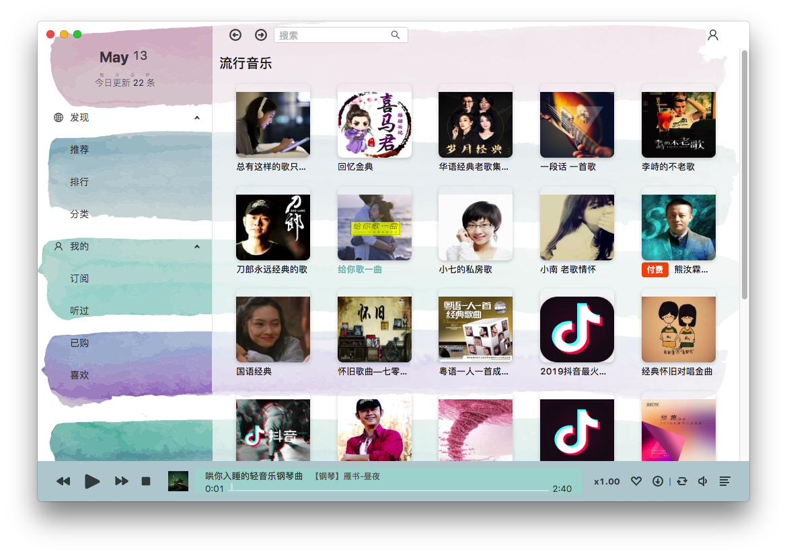

> GitHub: [zenghongtu/Mob](https://github.com/zenghongtu/Mob)

## 前言

最近一个月沉迷喜马拉雅无法自拔，听相声、段子、每日新闻，还有英语听力，摸鱼学习两不误。上班时候苦于没有桌面端，用网页版有些 bug，官方也不搞一个，只好自己动手了。样式参考了一下 Moon FM /t/555343，颜值还过得去，自我感觉挺好 😜😜😜

## 功能及 UI



目前实现的功能有这些：

- 一个基本的音乐播放器
- 每日必听
- 推荐
- 排行榜
- 分类
- 订阅
- 听过
- 下载声音
- 搜索专辑

## 技术选型

技术栈：

- [Electron](https://github.com/electron/electron)
- [Umi](https://github.com/umijs/umi)
- [Dva](https://github.com/dvajs/dva)
- [Antd](https://github.com/ant-design/ant-design)

之所以选择 Umi 是因为在之前项目中研究过其部分源码，开发体验感不错，而且 bug 也少。
还有一个原因是我在找模板的过程中，看到这个大佬的模板[wangtianlun/umi-electron-typescript](https://github.com/wangtianlun/umi-electron-typescript)，就直接拿来用了，大大减少了我搭建开发环境的时间，在此表示感谢~

> 如果你对 Umi 和 Dva 不熟，墙裂建议去学一下，分分钟就可以上手，而且开发效率要提高的不要太多。

## 开发篇

### React Hooks 使用问题

在开发中，所有组件、页面都是使用 React Hooks 进行开发的。而让我觉得最难以琢磨的一个 hooks 非 `useEffect` 莫属。

```javascript
// ...
useEffect(
  () => {
    ipcRenderer.on("HOTKEY", handleGlobalShortcut);
    ipcRenderer.on("DOWNLOAD", handleDownloadStatus);
    return () => {
      ipcRenderer.removeListener("HOTKEY", handleGlobalShortcut);
      ipcRenderer.removeListener("DOWNLOAD", handleDownloadStatus);
    };
  },
  [volume]
);
// ...
const handleGlobalShortcut = (e, hotkey) => {
  switch (hotkey) {
    case "nextTrack":
      handleNext();
      break;
    case "prevTrack":
      handlePrev();
      break;
    case "volumeUp":
      const volumeUp = volume > 0.95 ? 1 : volume + 0.05;
      handleVolume(volumeUp * 100);
      break;
    case "volumeDown":
      const volumeDown = volume < 0.05 ? 0 : volume - 0.05;
      handleVolume(volumeDown * 100);
      break;
    case "changePlayState":
      handlePlayPause();
      break;
    default:
      break;
  }
};
// ...
```

为了减少渲染次数，我会设置了第二参数为 `[volume]`，但这会导致一些出乎意料的情况，比如我触发了`changePlayState`，但却并没有得到意料中的值，这个时候设置为 `[volume, playState]` 就正常了。

原因很简单，因为`playState`不在依赖中，不会触发重新渲染

所以这条经验就是在使用 hook 遇到问题时，可以先试一下添加到`useEffect·中（如果有用到这个 hook 的话）

### 组件复用

先来看一下预览：


可以发现很多组件是相似的，如何提高他们的复用，这一个提高开发效率的途径。

在这个项目中我没有使用高阶组件，而是通过反正控制或者说是`render props`来进行复用，在组件的指定生命周期中进行调用。

共有三个组件在其他多个组件和页面中复用：

- 页面内容加载组件
- 专辑封面组件
- 专辑列表组件

页面内容加载组件如下：

```javascript
export interface Content<T, R> {
  render: (result: Result) => React.ReactNode;
  genRequestList: (params?: R[]) => Array<Promise<T>>;
  rspHandler: (rspArr: any, lastResult?: any) => Result;
  params?: R[];
}

export default function({
  params, // api 的请求参数
  genRequestList, // 负责返回 api 请求列表，返回值会被`Content`调用请求数据，返回值给`rspHandler`
  rspHandler, // 处理请求返回的`Response`值，返回值给`render`
  render //  负责渲染结果，将值传递给`render`函数中的组件
}: Content<any, any>) {
  const [loading, setLoading] = useState(true);
  const [hasError, setError] = useState(false);
  const [result, setResult] = useState(null);
  useEffect(
    () => {
      (async () => {
        try {
          setLoading(true);
          setError(false);
          const rspArr = await Promise.all(genRequestList(params));
          setResult(rspHandler(rspArr, result));
        } catch (e) {
          setError(true);
        } finally {
          setLoading(false);
        }
      })();
    },
    [params]
  );
  return (
    <div className={styles.contentWrap}>
      {loading && !result ? (
        <div className={styles.loading}>
          <Loading />
        </div>
      ) : hasError ? (
        <Empty image={Empty.PRESENTED_IMAGE_SIMPLE} />
      ) : (
        render(result)
      )}
    </div>
  );
}
```

### 利用缓存提高体验度

对 axios 的 get 请求进行封装，对每个请求 url 生成唯一值，如果在白名单内，存入 session storage 中，默认过期时间是 3600s，在下次访问时，直接返回该值。

这样做的一个问题是无法获得最新数据，但对比体验感来说并不那么严重。

```javascript
const request = ({ whitelist = [], expiry = DEFAULT_EXPIRY }) => ({
  ...instance,
  get: async (url: string, config?: AxiosRequestConfig) => {
    if (config) {
      config.url = url;
    }
    const fingerprint = JSON.stringify(config || url);
    // 判断是否需要缓存
    const isNeedCache = !whitelist.length || whitelist.includes(url);
    // 生成唯一值
    const hashKey = hash
      .sha256()
      .update(fingerprint)
      .digest("hex");

    if (expiry !== 0) {
      const cached = sessionStorage.getItem(hashKey);
      const lastCachedTS: number = +sessionStorage.getItem(`${hashKey}:TS`);
      if (cached !== null && lastCachedTS !== null) {
        const age = (Date.now() - lastCachedTS) / 1000;
        // 如果没有过期，就直接返回该值
        if (age < expiry) {
          return JSON.parse(cached);
        }
        // 否则清除之前的旧值
        sessionStorage.removeItem(hashKey);
        sessionStorage.removeItem(`${hashKey}:TS`);
      }
    }

    const rsp = await instance.get(url, config);

    if (isNeedCache) {
      cacheRsp(rsp, hashKey);
    }
    return rsp;
  }
});

export default request({ whitelist: [] });
```

### Flex `justify-content: space-between` 最后一行问题

在 flex 中设置`justify-content: space-between`后，在最后一行会出现让人不愉悦的情况。

对于这个问题，我的办法是通过计算然后填充空的`div`进去。

```tsx
const DEFAULT_WIDTH = 130;
const DEFAULT_PAGE_COUNT = 130;
const DEFAULT_WINDOW_WIDTH = 1040;
export default function({
  siderWidth = SIDE_BAR_WIDTH,
  pageCount = DEFAULT_PAGE_COUNT,
  divWidth = DEFAULT_WIDTH
}) {
  const [fillCount, setFillCount] = useState(0);
  const handleResize = debounce(e => {
    let innerWidth: number;
    if (e) {
      innerWidth = e.target.innerWidth;
    }
    // 当前容器的宽度
    const containerWidth = innerWidth || DEFAULT_WINDOW_WIDTH - siderWidth;
    // 每一行可以放的个数
    const rowDivCount = Math.floor(containerWidth / divWidth);
    // 需要填充的个数
    const count = rowDivCount - (pageCount % rowDivCount);
    setFillCount(count);
  }, 100);

  useEffect(() => {
    handleResize();
    window.addEventListener("resize", handleResize);
    return () => {
      window.removeEventListener("resize", handleResize);
    };
  }, []);
  return (
    <>
      {fillCount
        ? // 按照填充个数填进去
          Array.from({ length: fillCount }).map((_, idx) => {
            return (
              <div key={idx} style={{ width: divWidth, height: 0 }} className={styles.filler} />
            );
          })
        : null}
    </>
  );
}
```

### 路由的前进与后退

在`umi`或者说是`react-router`中，也只有`memory-router`可以判断是否可以前进或者后退。

只能自己记录一下 index，然后进行判断。

```tsx
let lastHistoryLen = 0;
const NavBar = ({ history, isLogin }) => {
  const { length, action } = history;

  const [curIndx, setCurIndx] = useState(0);
  const [suggests, setSuggests] = useState(null);
  const [text, setText] = useState('');
  const [visible, setVisible] = useState(false);

  useEffect(() => {
   // 判断最后历史记录的长度是否大于当前历史记录长度，如果是的话，把 index 归零
    if (lastHistoryLen > length) {
      setCurIndx(0);
    }
    lastHistoryLen = length;
  });

  const fetchSuggests = debounce(async (kw) => {
    if (!kw) {
      setSuggests(null);
      return;
    }
    const {
      data: { result },
    }: { data: SuggestRspData } = await getSuggest({ kw });
    let suggests = [...result.albumResultList, ...result.queryResultList];
    if (suggests.length < 1) {
      suggests = null;
    }
    // todo (only support albumResult now)
    setSuggests(suggests);
  }, 200);

// ...

  const handleArrowClick = (n) => {
    return () => {
      setCurIndx(curIndx + n);
      router.go(n);
    };
  };
```

### 如何登录

本来想着分析一下登录接口，但是这么做的话，如果还要加上扫码登录，要花不少时间。

于是乎想到了使用 `webview` 嵌入登录页面，在登录后，如果打开了个人页面就说明登录成功了。

```tsx
const TARGET_URL = "www.ximalaya.com/passport/sync_set";
const COOKIE_URL = "https://www.ximalaya.com";
const WebView = ({ onLoadedSession }) => {
  const [isLoading, setLoading] = useState(true);
  useEffect(() => {
    const webview = document.querySelector("#xmlyWebView") as HTMLElement;
    const handleDOMReady = e => {
      if (webview.getURL().includes(TARGET_URL)) {
        // todo fix prevent redirect
        e.preventDefault();
        const { session } = webview.getWebContents();
        onLoadedSession(session, COOKIE_URL);
        webview.reload();
      }
    };
    const handleLoadCommit = () => {
      setLoading(true);
    };
    const handleDidFinishLoad = () => {
      setLoading(false);
    };
    webview.addEventListener("dom-ready", handleDOMReady);
    webview.addEventListener("load-commit", handleLoadCommit);
    webview.addEventListener("did-finish-load", handleDidFinishLoad);
    return () => {
      webview.removeEventListener("dom-ready", handleDOMReady);
      webview.removeEventListener("load-commit", handleLoadCommit);
      webview.removeEventListener("did-finish-load", handleDidFinishLoad);
    };
  }, []);

  const props = {
    id: "xmlyWebView",
    useragent:
      // tslint:disable-next-line:max-line-length
      "Mozilla/5.0 (Macintosh; Intel Mac OS X 10_13_5) AppleWebKit/537.36 (KHTML, like Gecko) Chrome/73.0.3683.103 Safari/537.36",
    src: `https://${TARGET_URL}`,
    style: { widht: "750px", height: "600px" }
  };
  return (
    <div>
      <Spin tip="Loading..." spinning={isLoading}>
        <webview {...props} />
      </Spin>
    </div>
  );
};
```

## 最后

希望这篇文章能对你有所帮助。

[下载与体验](https://github.com/zenghongtu/Mob/releases/latest)
